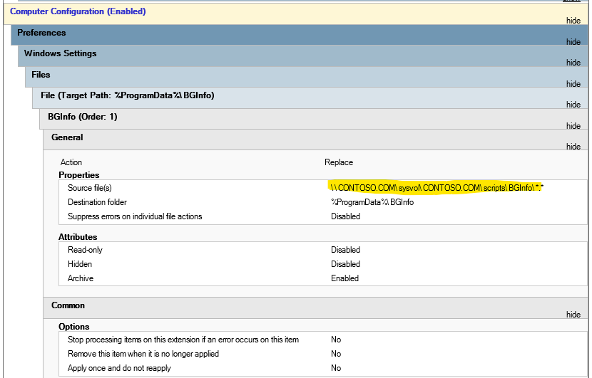

# GPO Backup to implement BGInfo

Download zip file to DC and extract https://github.com/Aabayoumy/GPO-BGInfo/archive/refs/heads/master.zip .
Download https://download.sysinternals.com/files/BGInfo.zip and copy Bginfo.exe or Bginfo64.exe to main folder (according to target machines architect 32 or/and 64 bit).
Cd to extracted folder and run this command on Administrative "Active Directory PowerShell"

```powershell
New-GPO BGInfo
Import-gpo -BackupGpoName BGInfo -TargetName BGInfo -Path "$((Get-Item .).FullName)"
Copy-Item Bginfo \\$Env:USERDNSDOMAIN\sysvol\$Env:USERDNSDOMAIN\scripts\ -force -Recurse
#Update Domain Name in GPO
((Get-Content -path '.\{8402A0FB-3416-47E2-82EB-6CE835FCA127}\DomainSysvol\GPO\Machine\Preferences\Files\Files.xml' -Raw) -replace "CONTOSO.COM", $Env:USERDNSDOMAIN) | Set-Content -Path '.\{8402A0FB-3416-47E2-82EB-6CE835FCA127}\DomainSysvol\GPO\Machine\Preferences\Files\Files.xml'
```

This commands will restore the GPO copy files to Sysvol Script Path and show you this path, take note of output path you need to update it in GPO .



<h4 align="center">Link "BGInfo" to Required OU 😊</h4>
