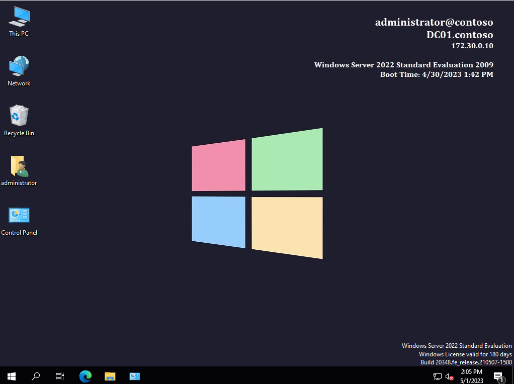

# GPO Backup to implement BGInfo

Download https://github.com/Aabayoumy/BGInfo-GPO/archive/refs/heads/master.zip to your computer and extract .

copy the extracted folder to Domain Controller
open powershell as administrator and CD to same folder you copied.
run commands :

```powershell
#Import Required Module to create and import GPO
Import-Module grouppolicy
#Update Domain Name in GPO
((Get-Content -path '.\{AB41A6CC-D880-4B3F-9D48-BA1DFAF73860}\DomainSysvol\GPO\Machine\Preferences\Files\Files.xml' -Raw) -replace "CONTOSO.LOCAL", $Env:USERDNSDOMAIN) | Set-Content -Path '.\{AB41A6CC-D880-4B3F-9D48-BA1DFAF73860}\DomainSysvol\GPO\Machine\Preferences\Files\Files.xml'
#Create & import New GPO
New-GPO BGInfo -Comment "https://github.com/Aabayoumy/BGInfo-GPO"
Import-gpo -BackupGpoName BGInfo -TargetName BGInfo -Path "$((Get-Item .).FullName)"
# Copy requred files to sysvol
Copy-Item Bginfo \\$Env:USERDNSDOMAIN\sysvol\$Env:USERDNSDOMAIN\scripts\ -force -Recurse
```

This commands will restore the GPO copy files to Sysvol Script Path and show you this path, Replace the Path in GPO with current domain name.
If you replace the wallpaper.jpg file in folder \\$Env:USERDNSDOMAIN\sysvol\$Env:USERDNSDOMAIN\scripts\BGinfo it's will effect client computers after next group policy apply.

Link "BGInfo" to Required OU 😊

Also BGinfo.html is report of GPO you can read it and create the GPO form scratch.



IP VBS script source : https://social.technet.microsoft.com/Forums/scriptcenter/en-US/bb74c2eb-eca2-455d-a270-8dd0f3d195e6/wmi-query-to-retrieve-only-active-ipv4-address
